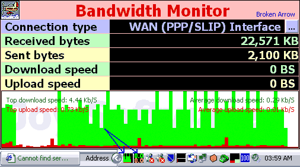



## Bandwidth Monitor \[UPDATE\]

### Description

*Real time network bandwith monitor *Animated analog/digital system tray icon speedometer *Database logging support *Crystal report functionality *Light weight *Massive update since previous ***It detects the currently available network traffic speed and displays an animated bar realtime bar graph both on the screen and in the system tray.

I used someone else's class modules to handle the network identification and just gave it an interface, I found that code here (csBandwidhMonitor). I am thankful to him/her.

Click on the application icon for menu. >>>> Download Crystal Reports ActiveX control from HTTP://www.BDSource.com/PrivateArea/Joy/Store/Crystl32.OCX (try using the URL in ur IE address bar in case of any trouble!) if you don't have it.    Mail me at Joy@BDSource.com in case of any difficulty.
 
### More Info
 

             |
---                |---
**Submitted On**   |2002-12-18 03:53:54
**By**             |[Broken Arrow](https://github.com/Planet-Source-Code/PSCIndex/blob/master/ByAuthor/broken-arrow.md)
**Level**          |Intermediate
**User Rating**    |4.7 (127 globes from 27 users)
**Compatibility**  |VB 5\.0, VB 6\.0
**Category**       |[Complete Applications](https://github.com/Planet-Source-Code/PSCIndex/blob/master/ByCategory/complete-applications__1-27.md)
**World**          |[Visual Basic](https://github.com/Planet-Source-Code/PSCIndex/blob/master/ByWorld/visual-basic.md)
**Archive File**   |[Bandwidth\_15149712172002\.zip](https://github.com/Planet-Source-Code/broken-arrow-bandwidth-monitor-update__1-41629/archive/master.zip)

